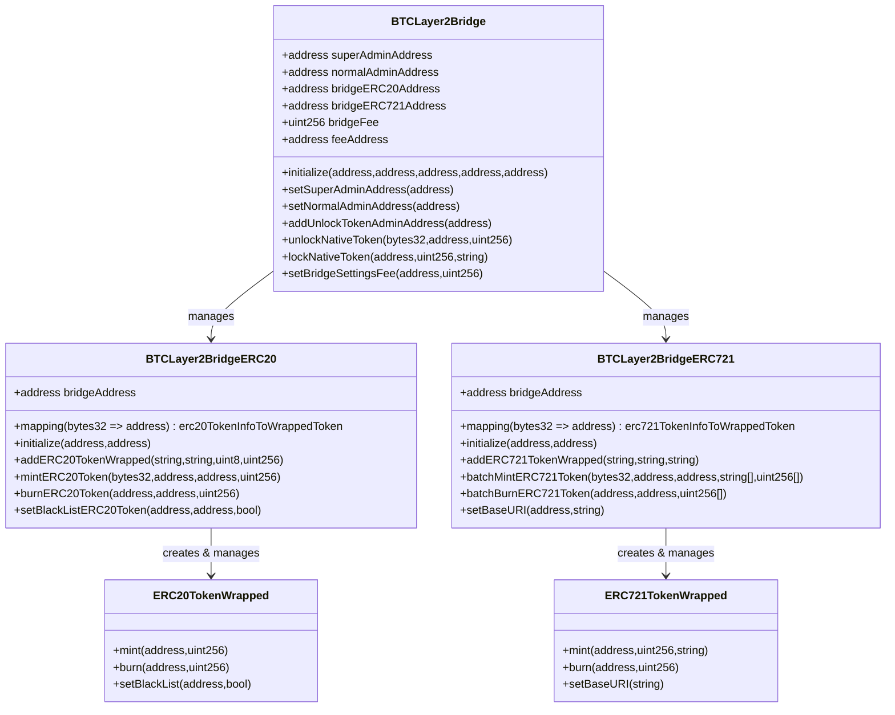

# BTC Layer 2 Bridge Architecture

## Overview
The BTC Layer 2 Bridge is a comprehensive system that enables bridging of native BTC, ERC20, and ERC721 tokens between Bitcoin and an EVM-compatible Layer 2 network. The system consists of several smart contracts that work together to provide a secure and efficient bridging mechanism.

## Contract Architecture

## Key Components

### 1. BTCLayer2Bridge
The main bridge contract that orchestrates the entire bridging system. It handles:
- Native BTC bridging (lock/unlock)
- Administration and access control
- Fee management
- Integration with ERC20 and ERC721 bridges

### 2. BTCLayer2BridgeERC20
Manages ERC20 token bridging:
- Creates wrapped ERC20 tokens
- Handles minting and burning of wrapped tokens
- Maintains token registry and transaction history

### 3. BTCLayer2BridgeERC721
Manages ERC721 token bridging:
- Creates wrapped ERC721 tokens
- Handles batch minting and burning of NFTs
- Manages token metadata and URIs

### 4. Wrapped Tokens
- `ERC20TokenWrapped`: Wrapped ERC20 token implementation
- `ERC721TokenWrapped`: Wrapped ERC721 token implementation

## Key Features

1. **Multi-Token Support**
   - Native BTC
   - ERC20 tokens
   - ERC721 tokens (NFTs)

2. **Security Features**
   - Multi-level admin system
   - Transaction hash tracking
   - Blacklist functionality
   - Pause mechanism

3. **Fee Management**
   - Configurable bridge fees
   - Fee whitelist system
   - Maximum fee limits

4. **Token Management**
   - Create2 deployment for wrapped tokens
   - Token metadata management
   - Batch operations for NFTs

## Access Control

The system implements a hierarchical access control system:
- Super Admin: Highest level of control
- Normal Admin: Secondary level of control
- Unlock Token Admin: Specific permissions for token unlocking
- Pause Admin: Ability to pause the system

## Events and Monitoring

The system emits various events for monitoring and tracking:
- Token minting/burning
- Admin changes
- Fee updates
- Bridge operations
- Blacklist updates

## Version Information
- BTCLayer2Bridge: v1.6.0
- BTCLayer2BridgeERC20: v1.2.0
- BTCLayer2BridgeERC721: v1.1.0 